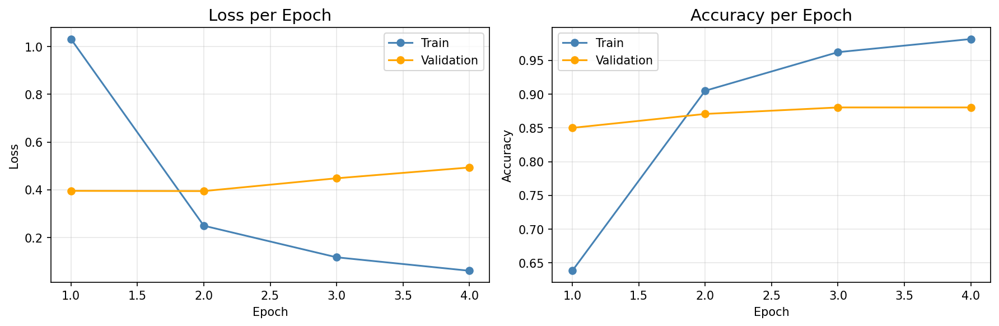
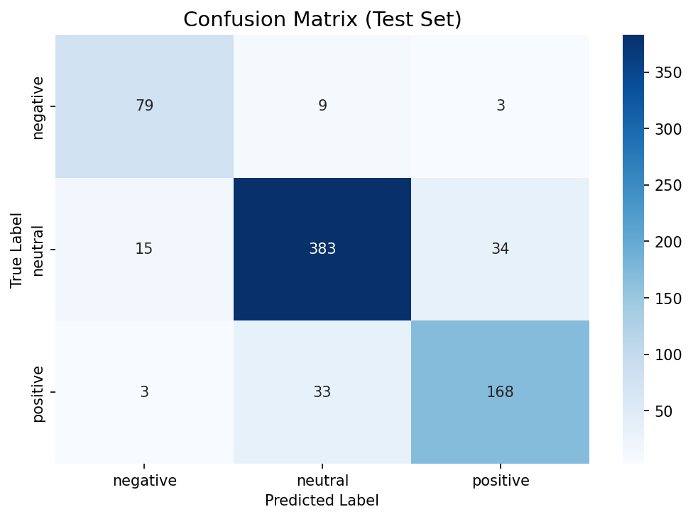
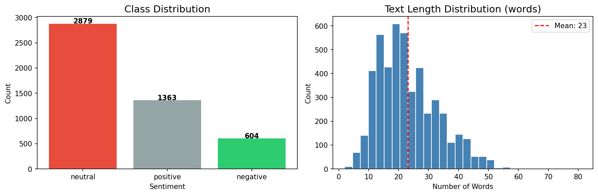

# Financial News Sentiment Analysis with FinBERT

Fine-tuning **FinBERT** (ProsusAI/finbert) to classify financial news sentences into **positive / neutral / negative** sentiment.

## 📌 Project Overview

Sentiment analysis of financial news is a core component in quantitative trading and financial AI systems. By understanding whether news carries positive or negative sentiment, models can be used to inform trading signals, risk assessment, and market analysis.

**Dataset:** [Financial PhraseBank](https://www.kaggle.com/datasets/ankurzing/sentiment-analysis-for-financial-news) (Malo et al., 2014)  
**Model:** ProsusAI/finbert (domain-specific BERT pre-trained on financial text)  
**Task:** 3-class text classification (positive / neutral / negative)

| Label | Class | Example |
|-------|-------|---------|
| 0 | Negative | *"Operating profit fell to EUR 22.4 mn from EUR 34.2 mn."* |
| 1 | Neutral | *"The board approved the acquisition of a Finnish company."* |
| 2 | Positive | *"The company reported record profits and raised its forecast."* |

## 📊 Results

| Metric | Score |
|--------|-------|
| **Test Accuracy** | 87.6% |
| **Negative Recall** | 86.8% (79/91) |
| **Neutral Recall** | 88.7% (383/432) |
| **Positive Recall** | 82.4% (168/204) |

### Training Curve

*Validation accuracy stabilizes at ~88% while training accuracy continues to rise — mild overfitting observed after epoch 2.*

### Confusion Matrix

*Model performs best on neutral class (dominant class). Positive sentences are occasionally misclassified as neutral (33 cases).*

### Dataset Distribution

*Imbalanced dataset: neutral (2,879) >> positive (1,363) > negative (604). Average sentence length: 23 words.*

## 🏗️ Model Architecture

```
ProsusAI/finbert (110M parameters, pre-trained on financial text)
  → [CLS] token embedding
  → Dropout(0.1)
  → Linear(768 → 3)
  → Softmax
Output: 3-class probability distribution
```

| Hyperparameter | Value |
|----------------|-------|
| Max Sequence Length | 128 |
| Batch Size | 16 |
| Epochs | 4 |
| Learning Rate | 2e-5 |
| Optimizer | AdamW + weight decay 0.01 |
| Scheduler | Linear warmup (10% steps) |
| Gradient Clipping | 1.0 |
| Loss Function | CrossEntropyLoss (class-weighted) |

## 📁 Project Structure

```
Financial-News-Sentiment-BERT/
├── sentiment_analysis.ipynb   # Main notebook
├── training_curve.png         # Loss & accuracy plots
├── confusion_matrix.png       # Confusion matrix
├── eda_plots.png              # EDA visualizations
├── best_model.pth             # Best model weights (generated)
├── requirements.txt
└── README.md
```

## 🚀 Getting Started

### 1. Clone the repo

```bash
git clone https://github.com/ned0624/Financial-News-Sentiment-BERT.git
cd Financial-News-Sentiment-BERT
```

### 2. Install dependencies

```bash
pip install -r requirements.txt
```

### 3. Prepare dataset

Download `all-data.csv` from [Kaggle](https://www.kaggle.com/datasets/ankurzing/sentiment-analysis-for-financial-news) and place it in the project root.

### 4. Run the notebook

Open `sentiment_analysis.ipynb` in Jupyter and run all cells.

> 💡 GPU recommended. CPU training takes approximately 20–30 minutes.

## 🛠️ Tech Stack

- **PyTorch** — training loop, GPU support
- **HuggingFace Transformers** — FinBERT model and tokenizer
- **scikit-learn** — evaluation metrics, train/test split, class weight computation
- **Matplotlib / Seaborn** — visualization

## 💡 Key Concepts Demonstrated

- Domain-specific BERT (FinBERT) fine-tuning for financial NLP
- Custom PyTorch `Dataset` class for text classification
- AdamW optimizer with linear warmup scheduler
- Weighted CrossEntropyLoss to handle class imbalance
- Gradient clipping for stable transformer training
- Evaluation with Accuracy, Confusion Matrix, and Per-class Recall

## 🔗 Related Projects

- [AOI Defect Classification with CNN](https://github.com/ned0624/Defect-Classifications-of-AOI)
- [Retinal Vessel Segmentation with U-Net](https://github.com/ned0624/Retinal-Vessel-Segmentation)
- [Western Blot Image Synthesis with cGAN](https://github.com/ned0624/Western-Blot-GAN)

---

*Dataset: Malo, P., Sinha, A., Korhonen, P., Wallenius, J., & Takala, P. (2014). Good debt or bad debt: Detecting semantic orientations in economic texts. Journal of the American Society for Information Science and Technology.*
